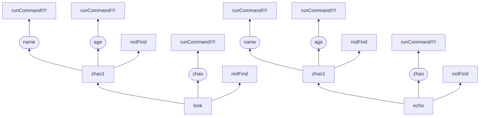

# Gravel-Grammar

## 介绍

用于命令代码等各种语法解析并进行自动回调的处理框架，能够实现良好的语法处理效果。命令类注册到命令回调类即可实现自动地处理效果，API简洁。

## 实际使用示例

```java
package zhao.gravel.grammar;

import zhao.gravel.grammar.command.ActuatorParam;
import zhao.gravel.grammar.command.GrammarParam;
import zhao.gravel.grammar.command.Syntax;
import zhao.gravel.grammar.core.CommandCallback;
import zhao.gravel.grammar.core.SyntaxCallback;

/**
 * @author zhao
 */
public class MAIN {
    public static void main(String[] args) {
        // 构建命令解析器第一层
        final Syntax echo = GrammarParam.create(
                "echo",
                // 构建命令解析器第二层的第一个分支
                GrammarParam.create(
                        "[zhao]",
                        // 构建命令解析器第三层 由于是最后一层，因此我们直接使用执行器
                        new ActuatorParam("name") {
                            /**
                             * @return 当前执行器参数的执行逻辑函数，执行完毕之后会返回一个任意数据类型。
                             * <p>
                             * The execution logic function of the current executor parameter will return an arbitrary data type after execution.
                             */
                            @Override
                            public Object run() {
                                return "zhao的名字是赵凌宇";
                            }
                        },
                        new ActuatorParam("age") {
                            /**
                             * @return 当前执行器参数的执行逻辑函数，执行完毕之后会返回一个任意数据类型。
                             * <p>
                             * The execution logic function of the current executor parameter will return an arbitrary data type after execution.
                             */
                            @Override
                            public Object run() {
                                return "zhao的年龄是20岁";
                            }
                        }
                ),
                // 在这里是第二层的另一个分支 直接添加执行器
                new ActuatorParam("zhao") {
                    @Override
                    public Object run() {
                        return "zhao";
                    }
                }
        );
        // 实例化一个回调类并将 echo 命令对象装载给回调函数类
        final SyntaxCallback syntaxCallback = CommandCallback.create(
                // 首先提供命令解析模式字符串，在这里我们以空格做拆分
                " ",
                // 然后我们提供参数对象
                echo
        );
        // 开始运行命令
        System.out.println(syntaxCallback.run("echo [zhao] name"));
        System.out.println(syntaxCallback.run("echo [zhao] age"));
        System.out.println(syntaxCallback.run("echo zhao"));
        // 下面是语法树的结构图

        /*
         *       echo
         *     /      \
         *   zhao    [zhao]
         *    |     /      \
         *   执行  name    age
         *          |      |
         *         执行    执行
         * */

    }
}

```

