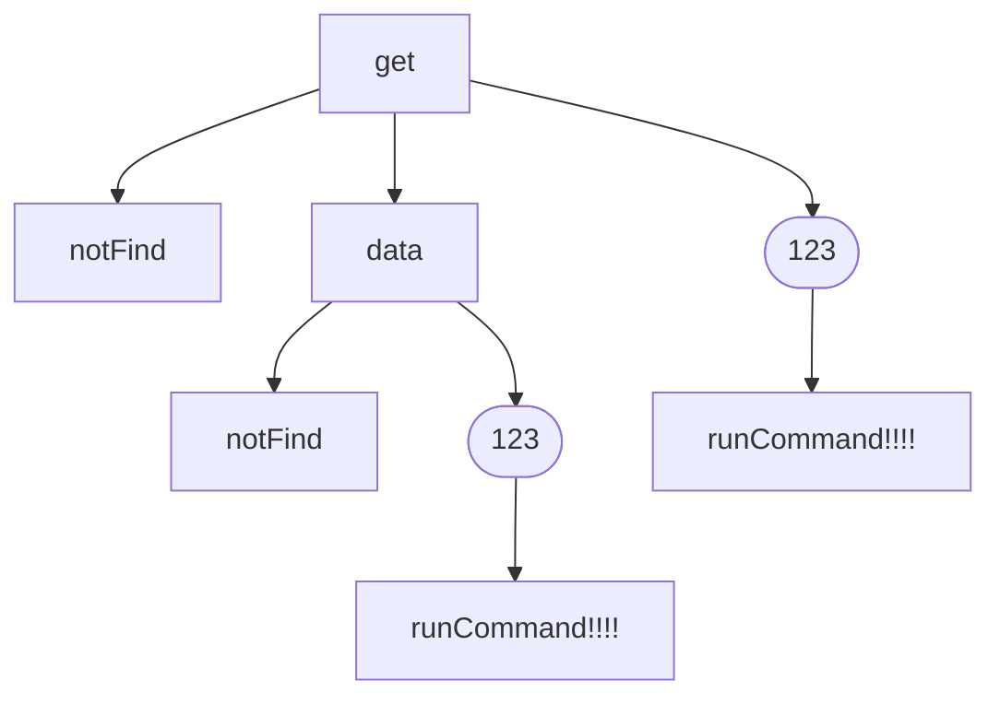
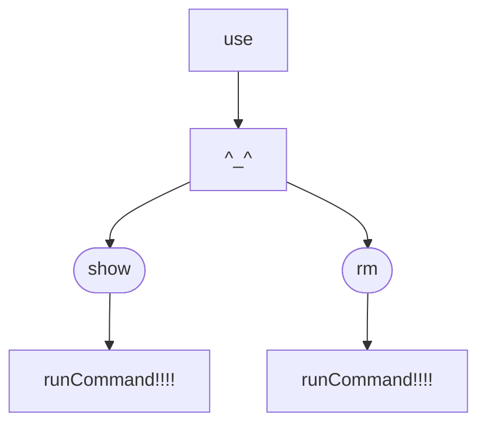
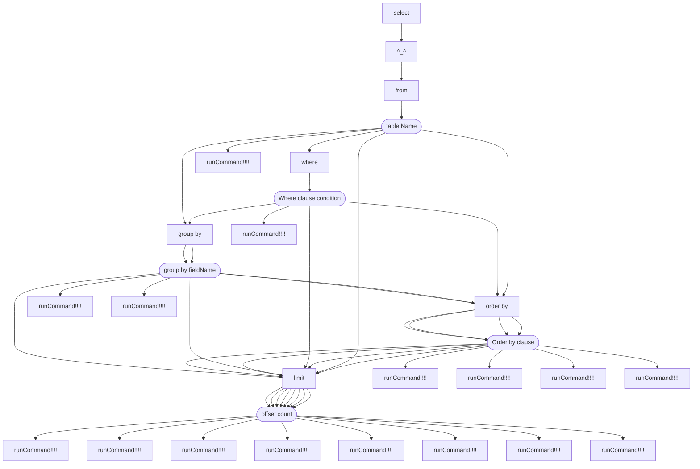

# Gravel-Grammar

## 介绍

用于命令代码等各种语法解析并进行自动回调的处理框架，能够实现良好的语法处理效果。命令类注册到命令回调类即可实现自动地处理效果，API简洁。

### 框架接入方式

该框架已上传到 maven 仓库，可以通过如下的 maven 依赖将框架导入到项目中，并按照介绍来使用此框架。

```xml

<dependencies>
    <dependency>
        <groupId>io.github.BeardedManZhao</groupId>
        <artifactId>gravel-Grammar</artifactId>
        <version>1.0.20230927</version>
    </dependency>
</dependencies>
```

## 模块

在这里我们介绍了该框架的诸多组成，有助于使用者理解此框架的API调用方式，能够快速上手框架，并接入到各自的项目中。

### 语法对象

接口名称：zhao.gravel.grammar.command.Syntax

#### GrammarParam 类

此对象是一个最基本的语法类，其中存储着一个语法树的完整结构，并具有子语法对象的查询功能，通过针对此对象的嵌套，可以实现有效的语法树的构造，下面就是一个简单的语法树构造示例。

```java
package zhao.gravel.grammar;

import zhao.gravel.grammar.command.ActuatorParam;
import zhao.gravel.grammar.command.GrammarParam;
import zhao.gravel.grammar.command.Syntax;

/**
 * @author zhao
 */
public class MAIN {
    public static void main(String[] args) {
        // 实例化一个语法对象的第一层
        final Syntax syntax = getSyntax();
        // 查看语法树结构
        System.out.println(syntax);
    }

    private static Syntax getSyntax() {
        return GrammarParam.create(
                "get",
                // 实例化语法对象的第二层的第一个分支
                GrammarParam.create(
                        "data",
                        // 实例化 get data 123 命令的执行器
                        new ActuatorParam("123") {
                            @Override
                            public Object run() {
                                return "执行 get data 123 命令";
                            }
                        }
                ),
                // 实例化语法对象的第二层的第二个分支 这里是一个执行器
                new ActuatorParam("123") {
                    @Override
                    public Object run() {
                        return "执行 get 123 命令";
                    }
                }
        );
    }
}
```



#### SaveParam 类

顾名思义这是一个具有保存功能的类，如果想要从此类中提取出一个通配对象，那么其会将当前提取的参数做为变量保存到一个容器中，一般来说，在最终执行器中会根据变量来进行相对应的操作，接下来是一个简单的示例。

```java
package zhao.gravel.grammar;

import zhao.gravel.grammar.command.ActuatorParam;
import zhao.gravel.grammar.command.SaveParam;
import zhao.gravel.grammar.command.Syntax;

import java.util.ArrayList;

/**
 * @author zhao
 */
public class MAIN {
    public static void main(String[] args) {
        // 实例化一个语法对象的第一层
        final Syntax syntax = getSyntax();
        // 查看语法树结构
        System.out.println(syntax);
    }

    private static Syntax getSyntax() {
        // 准备一个变量容器
        HashMap<String, Object> hashMap = new ArrayList<>();
        // 开始构建 具有变量保存功能的语法树
        return SaveParam.create(
                "use", hashMap,
                SaveParam.create(
                        Syntax.WILDCARD, hashMap,
                        // 设置 use [param] show 命令的执行器
                        new ActuatorParam("show") {
                            @Override
                            public Object run() {
                                return "show " + hashMap.get("show");
                            }
                        },
                        // 设置 use [param] rm 命令的执行器
                        new ActuatorParam("show_list") {
                            @Override
                            public Object run() {
                                return hashMap.clone();
                            }
                        }
                )
        );
    }
}
```



### 回调器对象

类名称：zhao.gravel.grammar.core.SyntaxCallback

回调器是一种用于搜索语法树节点，并执行其对应逻辑的组件，其能够按照一定的规则来进行语法的解析，同时可以根据参数的有效路径找到指定的执行器对象，下面就是一个简单的示例，在示例中我们将语法树装载到了回调器中，并使用回调器执行了对应的命令。

```java
package zhao.gravel.grammar;

import zhao.gravel.grammar.command.ActuatorParam;
import zhao.gravel.grammar.command.SaveParam;
import zhao.gravel.grammar.command.Syntax;
import zhao.gravel.grammar.core.CommandCallback;
import zhao.gravel.grammar.core.model.AnalyticalModel;

import java.util.ArrayList;
import java.util.HashMap;

/**
 * @author zhao
 */
public class MAIN {
    public static void main(String[] args) {
        // 实例化一个语法对象的第一层
        final Syntax syntax = getSyntax();
        // 创建一个回调器
        final CommandCallback get = CommandCallback.createGet(
                // 设置语法器在解析命令的时候使用的匹配模式
                "\\s+",
                // 将语法树提供给回调器
                syntax
        );
        // 设置回调器的解析模式 TODO 设置为按照字符串解析 这也是默认的解析模式
        get.setAnalyticalModel(AnalyticalModel.CHARACTER_PATTERN);
        // TODO 当然，也可以设置为按照正则解析
        get.setAnalyticalModel(AnalyticalModel.REGULAR_MODEL);
        // 开始执行一些语句并打印结果
        System.out.println(get.run("use zhao show"));
        System.out.println(get.run("use zhao show_list"));
    }

    private static Syntax getSyntax() {
        // 准备一个变量容器
        HashMap<String, Object> hashMap = new ArrayList<>();
        // 开始构建 具有变量保存功能的语法树
        return SaveParam.create(
                "use", hashMap,
                SaveParam.create(
                        Syntax.WILDCARD, hashMap,
                        // 设置 use [param] show 命令的执行器
                        new ActuatorParam("show") {
                            @Override
                            public Object run() {
                                return "show " + hashMap.get("show");
                            }
                        },
                        // 设置 use [param] rm 命令的执行器
                        new ActuatorParam("show_list") {
                            @Override
                            public Object run() {
                                return hashMap.clone();
                            }
                        }
                )
        );
    }
}

```

```
show zhao
[zhao]
```

## 实际使用示例

### 手动实现语法解析器

我们可以通过装饰器的构造方式来在 create 函数中添加子语法参数，实现语法树的构建操作，其图示如下所示。

[image]

在下面展示的就是通过 create 函数创建一个解析树并将树提供给回调器的操作示例。

```java
package zhao.gravel.grammar;

import zhao.gravel.grammar.command.ActuatorParam;
import zhao.gravel.grammar.command.GrammarParam;
import zhao.gravel.grammar.command.Syntax;
import zhao.gravel.grammar.core.CommandCallback;
import zhao.gravel.grammar.core.SyntaxCallback;

/**
 * @author zhao
 */
public class MAIN {
    public static void main(String[] args) {
        // 构建命令解析器第一层
        final Syntax echo = GrammarParam.create(
                "echo",
                // 构建命令解析器第二层的第一个分支
                GrammarParam.create(
                        "[zhao]",
                        // 构建命令解析器第三层 由于是最后一层，因此我们直接使用执行器
                        new ActuatorParam("name") {
                            /**
                             * @return 当前执行器参数的执行逻辑函数，执行完毕之后会返回一个任意数据类型。
                             * <p>
                             * The execution logic function of the current executor parameter will return an arbitrary data type after execution.
                             */
                            @Override
                            public Object run() {
                                return "zhao的名字是赵凌宇";
                            }
                        },
                        new ActuatorParam("age") {
                            /**
                             * @return 当前执行器参数的执行逻辑函数，执行完毕之后会返回一个任意数据类型。
                             * <p>
                             * The execution logic function of the current executor parameter will return an arbitrary data type after execution.
                             */
                            @Override
                            public Object run() {
                                return "zhao的年龄是20岁";
                            }
                        }
                ),
                // 在这里是第二层的另一个分支 直接添加执行器
                new ActuatorParam("zhao") {
                    @Override
                    public Object run() {
                        return "zhao";
                    }
                }
        );
        // 实例化一个回调类并将 echo 命令对象装载给回调函数类
        final SyntaxCallback syntaxCallback = CommandCallback.create(
                // 首先提供命令解析模式字符串，在这里我们以空格做拆分
                " ",
                // 然后我们提供参数对象
                echo
        );
        // 开始运行命令
        System.out.println(syntaxCallback.run("echo [zhao] name"));
        System.out.println(syntaxCallback.run("echo [zhao] age"));
        System.out.println(syntaxCallback.run("echo zhao"));
        // 下面是语法树的结构图

        /*
         *       echo
         *     /      \
         *   zhao    [zhao]
         *    |     /      \
         *   执行  name    age
         *          |      |
         *         执行    执行
         * */

    }
}

```

### 使用内置的语法树对象

内置语法树是一些常用的通用的语法树对象，我们通过 BuiltInGrammar 枚举类存储这类语法树，接下来我们在下面展示了使用内置SQL查询语法树的示例。

```java
package zhao.gravel.grammar;

import zhao.gravel.grammar.command.Syntax;
import zhao.gravel.grammar.core.BuiltInGrammar;
import zhao.gravel.grammar.core.BuiltInReg;
import zhao.gravel.grammar.core.CommandCallback;
import zhao.gravel.grammar.core.model.AnalyticalModel;

/**
 * @author zhao
 */
public class MAIN {
    public static void main(String[] args) {
        // 获取到 SQL查询 语法对象 并设置 表 与 where子句的回调函数
        final Syntax instance = BuiltInGrammar.SQL_SELECT.get(
                hashMap -> "当前位于表处理函数 " + hashMap,
                hashMap -> "当前位于where子句处理函数 " + hashMap,
                hashMap -> "当前位于group by处理函数 " + hashMap,
                hashMap -> "当前位于order by处理函数 " + hashMap,
                hashMap -> "当前位于  limit 处理函数 " + hashMap
        );
        // 装载到回调器
        final CommandCallback sql = CommandCallback.createGet(
                // 设置 SQL解析 的正则匹配表达式类型，在这里使用的是能够被 REGULAR_MODEL_1 解析的模式
                BuiltInReg.SQL_EXTRACTION_REGULAR_MODEL_1,
                instance
        );
        // 设置解析模式为 正则提取1号组数据
        sql.setAnalyticalModel(AnalyticalModel.REGULAR_MODEL_1);
        // 在回调器中执行命令
        System.out.println(sql.run("select * from zhao;"));
        System.out.println(sql.run("select * from zhao where age=20;"));
        System.out.println(sql.run("select * from zhao where age=20 group by age;"));
        System.out.println(sql.run("select * from zhao where age=20 order by age limit 10 20;"));
        System.out.println(sql);
    }
}


```

下面是运行结果，可以看到其中成功地处理了两个命令并将对应的结果返回了出来，而在我们打印了回调器的时候，实际上是将回调器中的语法树结构图的代码打印了出来。

```
当前位于表处理函数 {select=*, from=zhao;}
当前位于where子句处理函数 {select=*, from=zhao, where=age=20;}
当前位于group by处理函数 {select=*, group by=age;, from=zhao, where=age=20}
当前位于  limit 处理函数 {select=*, order by=age, limit=10 20;, from=zhao, where=age=20}
graph BR
1.740000325E9[select] --> 9.32607259E8[^_^]
9.32607259E8[^_^] --> 1.57627094E8[from]
1.57627094E8[from] --> 7.18231523E8[^_^]
7.18231523E8[^_^] --> 1.504109395E9[order by]
1.504109395E9[order by] --> 1.025799482E9[^_^]
1.025799482E9[^_^] --> 3.98887205E8[limit]
3.98887205E8[limit] --> 1.468177767E9[^_^]
1.468177767E9([offset count]) --> 0.5627176415604082[runCommand!!!!]
1.025799482E9([Order by clause]) --> 0.19879988313180497[runCommand!!!!]
7.18231523E8[^_^] --> 3.98887205E8[limit]
3.98887205E8[limit] --> 1.468177767E9[^_^]
1.468177767E9([offset count]) --> 0.8433204212510476[runCommand!!!!]
7.18231523E8[^_^] --> 1.349414238E9[where]
1.349414238E9[where] --> 7.62218386E8[^_^]
7.62218386E8[^_^] --> 1.504109395E9[order by]
1.504109395E9[order by] --> 1.025799482E9[^_^]
1.025799482E9[^_^] --> 3.98887205E8[limit]
3.98887205E8[limit] --> 1.468177767E9[^_^]
1.468177767E9([offset count]) --> 0.12488731309599099[runCommand!!!!]
1.025799482E9([Order by clause]) --> 0.38751006766773[runCommand!!!!]
7.62218386E8[^_^] --> 3.98887205E8[limit]
3.98887205E8[limit] --> 1.468177767E9[^_^]
1.468177767E9([offset count]) --> 0.405136527007931[runCommand!!!!]
7.62218386E8[^_^] --> 1.873653341E9[group by]
1.873653341E9[group by] --> 1.908316405E9[^_^]
1.908316405E9[^_^] --> 1.504109395E9[order by]
1.504109395E9[order by] --> 1.025799482E9[^_^]
1.025799482E9[^_^] --> 3.98887205E8[limit]
3.98887205E8[limit] --> 1.468177767E9[^_^]
1.468177767E9([offset count]) --> 0.3493721134215404[runCommand!!!!]
1.025799482E9([Order by clause]) --> 0.18895448365909584[runCommand!!!!]
1.908316405E9[^_^] --> 3.98887205E8[limit]
3.98887205E8[limit] --> 1.468177767E9[^_^]
1.468177767E9([offset count]) --> 0.03925965668096232[runCommand!!!!]
1.908316405E9([group by fieldName]) --> 0.8819858478815389[runCommand!!!!]
7.62218386E8([Where clause condition]) --> 0.9041228337851761[runCommand!!!!]
7.18231523E8[^_^] --> 1.873653341E9[group by]
1.873653341E9[group by] --> 1.908316405E9[^_^]
1.908316405E9[^_^] --> 1.504109395E9[order by]
1.504109395E9[order by] --> 1.025799482E9[^_^]
1.025799482E9[^_^] --> 3.98887205E8[limit]
3.98887205E8[limit] --> 1.468177767E9[^_^]
1.468177767E9([offset count]) --> 0.9798902184562694[runCommand!!!!]
1.025799482E9([Order by clause]) --> 0.40897488489984957[runCommand!!!!]
1.908316405E9[^_^] --> 3.98887205E8[limit]
3.98887205E8[limit] --> 1.468177767E9[^_^]
1.468177767E9([offset count]) --> 0.02504592954225726[runCommand!!!!]
1.908316405E9([group by fieldName]) --> 0.8615177648386168[runCommand!!!!]
7.18231523E8([table Name]) --> 0.1773248339953667[runCommand!!!!]
```


