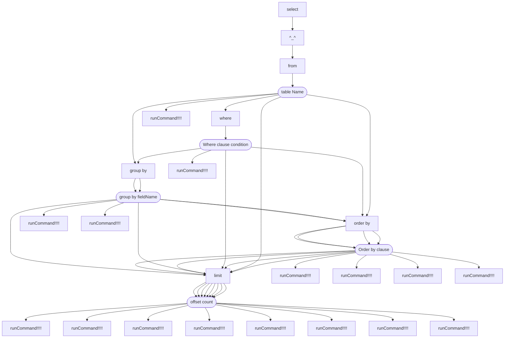

# Gravel-Grammar

## introduce

A processing framework for parsing various syntax such as command code and performing automatic callbacks can achieve
good syntax processing results. Registering the command class to the command callback class can achieve automatic
processing effects, and the API is concise.

### Framework access method

The framework has been uploaded to the Maven repository, and can be imported into the project through the Maven
dependencies below, and used as described.

```xml

<dependencies>
    <dependency>
        <groupId>io.github.BeardedManZhao</groupId>
        <artifactId>gravel-Grammar</artifactId>
        <version>1.0.20230927</version>
    </dependency>
</dependencies>
```

## module

Here, we have introduced many components of the framework, which helps users understand the API calling methods of the
framework, quickly get started with the framework, and integrate it into their respective projects.

### Grammar Object

Interface name: zhao.gravel.grammar.command.Syntax

#### GrammarParam class

This object is the most basic syntax class, which stores the complete structure of a syntax tree and has the query
function of sub syntax objects. By nesting this object, effective syntax tree construction can be achieved. Below is a
simple syntax tree construction example.

```java
package zhao.gravel.grammar;

import zhao.gravel.grammar.command.ActuatorParam;
import zhao.gravel.grammar.command.GrammarParam;
import zhao.gravel.grammar.command.Syntax;

/**
 * @author zhao
 */
public class MAIN {
    public static void main(String[] args) {
        // Instantiate the first level of a syntax object
        final Syntax syntax = getSyntax();
        // View the syntax tree structure
        System.out.println(syntax);
    }

    private static Syntax getSyntax() {
        return GrammarParam.create(
                "get",
                // instantiate the first branch of the second level of the syntax object
                GrammarParam.create(
                        "data",
                        // instantiate the executor for the get data 123 command
                        new ActuatorParam("123") {
                            @Override
                            public Object run() {
                                return "Execute the get data 123 command";
                            }
                        }
                ),
                // Instantiate the second branch of the second level of the syntax object Here is an executor
                new ActuatorParam("123") {
                    @Override
                    public Object run() {
                        return "Execute the get 123 command";
                    }
                }
        );
    }
}
```


#### SaveParam class

As the name suggests, this is a class with save function. If you want to extract a wildcard object from this class, it
will save the currently extracted parameters as variables into a container. Generally speaking, in the final executor,
corresponding operations will be performed based on the variables. Here is a simple example.

```java
package zhao.gravel.grammar;

import zhao.gravel.grammar.command.ActuatorParam;
import zhao.gravel.grammar.command.SaveParam;
import zhao.gravel.grammar.command.Syntax;

import java.util.ArrayList;

/**
 * @author zhao
 */
public class MAIN {
    public static void main(String[] args) {
        // Instantiate the first level of a syntax object
        final Syntax syntax = getSyntax();
        // View the syntax tree structure
        System.out.println(syntax);
    }

    private static Syntax getSyntax() {
        // Prepare a variable container
        HashMap<String, Object> arrayList = new ArrayList<>();
        // Start building a syntax tree with variable saving function
        return SaveParam.create(
                "use", arrayList,
                SaveParam.create(
                        Syntax.WILDCARD, arrayList,
                        // Set the executor of the use [param] show command
                        new ActuatorParam("show") {
                            @Override
                            public Object run() {
                                return "show " + arrayList.get("show");
                            }
                        },
                        // Set the executor of the use [param] rm command
                        new ActuatorParam("show_list") {
                            @Override
                            public Object run() {
                                return arrayList;
                            }
                        }
                )
        );
    }
}
```


### Callback Object

class name：zhao.gravel.grammar.core.SyntaxCallback

A callback is a component used to search for syntax tree nodes and execute their corresponding logic. It can parse
syntax according to certain rules and find the specified executor object based on the valid path of parameters. Below is
a simple example where we load the syntax tree into the callback and execute the corresponding command using the
callback.

```java
package zhao.gravel.grammar;

import zhao.gravel.grammar.command.ActuatorParam;
import zhao.gravel.grammar.command.SaveParam;
import zhao.gravel.grammar.command.Syntax;
import zhao.gravel.grammar.core.CommandCallback;
import zhao.gravel.grammar.core.model.AnalyticalModel;

import java.util.ArrayList;
import java.util.HashMap;

/**
 * @author zhao
 */
public class MAIN {
    public static void main(String[] args) {
        // Instantiate the first layer of a grammar object
        final Syntax syntax = getSyntax();
        // Create a callback
        final CommandCallback get = CommandCallback.createGet(
                // Set the matching mode used by the grammar when parsing commands
                "\\s+",
                // Provide a syntax tree to the callback
                syntax
        );
        // Set the callback's parsing mode TODO to parse by string, which is also the default parsing mode
        get.setAnalyticalModel(AnalyticalModel.CHARACTER_PATTERN);
        // TODO, of course, can also be set to parse according to regular rules
        get.setAnalyticalModel(AnalyticalModel.REGULAR_MODEL);
        // Start executing some statements and printing the results
        System.out.println(get.run("use zhao show"));
        System.out.println(get.run("use zhao show_list"));
    }

    private static Syntax getSyntax() {
        // Prepare a variable container
        HashMap<String, Object> arrayList = new ArrayList<>();
        // Start building a syntax tree with variable saving function
        return SaveParam.create(
                "use", arrayList,
                SaveParam.create(
                        Syntax.WILDCARD, arrayList,
                        // Set the executor of the use [param] show command
                        new ActuatorParam("show") {
                            @Override
                            public Object run() {
                                return "show " + arrayList.get("show");
                            }
                        },
                        // Set the executor of the use [param] rm command
                        new ActuatorParam("show_list") {
                            @Override
                            public Object run() {
                                return arrayList;
                            }
                        }
                )
        );
    }
}

```

```
show zhao
[zhao]
```

## Practical usage examples

### 手动实现语法解析器

[image]

在下面展示的就是通过 create 函数创建一个解析树并将树提供给回调器的操作示例。

```java
package zhao.gravel.grammar;

import zhao.gravel.grammar.command.ActuatorParam;
import zhao.gravel.grammar.command.GrammarParam;
import zhao.gravel.grammar.command.Syntax;
import zhao.gravel.grammar.core.CommandCallback;
import zhao.gravel.grammar.core.SyntaxCallback;

/**
 * @author zhao
 */
public class MAIN {
    public static void main(String[] args) {
        // Build the first layer of command parser
        final Syntax echo = GrammarParam.create(
                "echo",
                // Build the first branch of the second layer of the command parser
                GrammarParam.create(
                        "[zhao]",
                        // Building the third layer of the command parser, as it is the last layer, we directly use the executor
                        new ActuatorParam("name") {
                            /**
                             * @return 当前执行器参数的执行逻辑函数，执行完毕之后会返回一个任意数据类型。
                             * <p>
                             * The execution logic function of the current executor parameter will return an arbitrary data type after execution.
                             */
                            @Override
                            public Object run() {
                                return "zhao的名字是赵凌宇";
                            }
                        },
                        new ActuatorParam("age") {
                            /**
                             * @return 当前执行器参数的执行逻辑函数，执行完毕之后会返回一个任意数据类型。
                             * <p>
                             * The execution logic function of the current executor parameter will return an arbitrary data type after execution.
                             */
                            @Override
                            public Object run() {
                                return "zhao的年龄是20岁";
                            }
                        }
                ),
                // Here is another branch of the second layer where the executor is directly added
                new ActuatorParam("zhao") {
                    @Override
                    public Object run() {
                        return "zhao";
                    }
                }
        );
        // Instantiate a callback class and load the echo command object into the callback function class
        final SyntaxCallback syntaxCallback = CommandCallback.create(
                // Firstly, provide the command parsing mode string, where we get it with spaces
                " ",
                // Then we provide parameter objects
                echo
        );
        // Start running command
        System.out.println(syntaxCallback.run("echo [zhao] name"));
        System.out.println(syntaxCallback.run("echo [zhao] age"));
        System.out.println(syntaxCallback.run("echo zhao"));
        // The following is the structure diagram of the syntax tree

        /*
         *       echo
         *     /      \
         *   zhao    [zhao]
         *    |     /      \
         *   执行  name    age
         *          |      |
         *         执行    执行
         * */

    }
}

```

### 使用内置的语法树对象

内置语法树是一些常用的通用的语法树对象，我们通过 BuiltInGrammar 枚举类存储这类语法树，接下来我们在下面展示了使用内置SQL查询语法树的示例。

```java
package zhao.gravel.grammar;

import zhao.gravel.grammar.command.Syntax;
import zhao.gravel.grammar.core.BuiltInGrammar;
import zhao.gravel.grammar.core.CommandCallback;

/**
 * @author zhao
 */
public class MAIN {
    public static void main(String[] args) {
        // Obtain the SQL query syntax object and set the callback function for the table and where clause
        final Syntax instance = BuiltInGrammar.SQL_SELECT.get(
                hashMap -> "当前位于表处理函数 " + hashMap,
                hashMap -> "当前位于where子句处理函数 " + hashMap,
                hashMap -> "当前位于group by处理函数 " + hashMap,
                hashMap -> "当前位于order by处理函数 " + hashMap,
                hashMap -> "当前位于  limit 处理函数 " + hashMap
        );
        // Load to callback
        final CommandCallback sql = CommandCallback.createGet(
                // Set the type of regular matching expression for SQL parsing, where it can be REGULAR_ MODEL_ 1 Parsed mode
                BuiltInReg.SQL_EXTRACTION_REGULAR_MODEL_1,
                instance
        );
        // Set the parsing mode to regular extraction of group 1 data
        sql.setAnalyticalModel(AnalyticalModel.REGULAR_MODEL_1);
        // Executing commands in a callback
        System.out.println(sql.run("select * from zhao;"));
        System.out.println(sql.run("select * from zhao where age=20;"));
        System.out.println(sql.run("select * from zhao where age=20 group by age;"));
        System.out.println(sql.run("select * from zhao where age=20 order by age limit 10 20;"));
        System.out.println(sql);
    }
}

```

The following are the running results, where we can see that two commands were successfully processed and the
corresponding results were returned. When we printed the callback, we actually printed the code of the syntax tree
structure diagram in the callback.

```
当前位于表处理函数 {select=*, from=zhao;}
当前位于where子句处理函数 {select=*, from=zhao, where=age=20;}
当前位于group by处理函数 {select=*, group by=age;, from=zhao, where=age=20}
当前位于  limit 处理函数 {select=*, order by=age, limit=10 20;, from=zhao, where=age=20}
graph BR
1.740000325E9[select] --> 9.32607259E8[^_^]
9.32607259E8[^_^] --> 1.57627094E8[from]
1.57627094E8[from] --> 7.18231523E8[^_^]
7.18231523E8[^_^] --> 1.504109395E9[order by]
1.504109395E9[order by] --> 1.025799482E9[^_^]
1.025799482E9[^_^] --> 3.98887205E8[limit]
3.98887205E8[limit] --> 1.468177767E9[^_^]
1.468177767E9([offset count]) --> 0.5627176415604082[runCommand!!!!]
1.025799482E9([Order by clause]) --> 0.19879988313180497[runCommand!!!!]
7.18231523E8[^_^] --> 3.98887205E8[limit]
3.98887205E8[limit] --> 1.468177767E9[^_^]
1.468177767E9([offset count]) --> 0.8433204212510476[runCommand!!!!]
7.18231523E8[^_^] --> 1.349414238E9[where]
1.349414238E9[where] --> 7.62218386E8[^_^]
7.62218386E8[^_^] --> 1.504109395E9[order by]
1.504109395E9[order by] --> 1.025799482E9[^_^]
1.025799482E9[^_^] --> 3.98887205E8[limit]
3.98887205E8[limit] --> 1.468177767E9[^_^]
1.468177767E9([offset count]) --> 0.12488731309599099[runCommand!!!!]
1.025799482E9([Order by clause]) --> 0.38751006766773[runCommand!!!!]
7.62218386E8[^_^] --> 3.98887205E8[limit]
3.98887205E8[limit] --> 1.468177767E9[^_^]
1.468177767E9([offset count]) --> 0.405136527007931[runCommand!!!!]
7.62218386E8[^_^] --> 1.873653341E9[group by]
1.873653341E9[group by] --> 1.908316405E9[^_^]
1.908316405E9[^_^] --> 1.504109395E9[order by]
1.504109395E9[order by] --> 1.025799482E9[^_^]
1.025799482E9[^_^] --> 3.98887205E8[limit]
3.98887205E8[limit] --> 1.468177767E9[^_^]
1.468177767E9([offset count]) --> 0.3493721134215404[runCommand!!!!]
1.025799482E9([Order by clause]) --> 0.18895448365909584[runCommand!!!!]
1.908316405E9[^_^] --> 3.98887205E8[limit]
3.98887205E8[limit] --> 1.468177767E9[^_^]
1.468177767E9([offset count]) --> 0.03925965668096232[runCommand!!!!]
1.908316405E9([group by fieldName]) --> 0.8819858478815389[runCommand!!!!]
7.62218386E8([Where clause condition]) --> 0.9041228337851761[runCommand!!!!]
7.18231523E8[^_^] --> 1.873653341E9[group by]
1.873653341E9[group by] --> 1.908316405E9[^_^]
1.908316405E9[^_^] --> 1.504109395E9[order by]
1.504109395E9[order by] --> 1.025799482E9[^_^]
1.025799482E9[^_^] --> 3.98887205E8[limit]
3.98887205E8[limit] --> 1.468177767E9[^_^]
1.468177767E9([offset count]) --> 0.9798902184562694[runCommand!!!!]
1.025799482E9([Order by clause]) --> 0.40897488489984957[runCommand!!!!]
1.908316405E9[^_^] --> 3.98887205E8[limit]
3.98887205E8[limit] --> 1.468177767E9[^_^]
1.468177767E9([offset count]) --> 0.02504592954225726[runCommand!!!!]
1.908316405E9([group by fieldName]) --> 0.8615177648386168[runCommand!!!!]
7.18231523E8([table Name]) --> 0.1773248339953667[runCommand!!!!]
```

