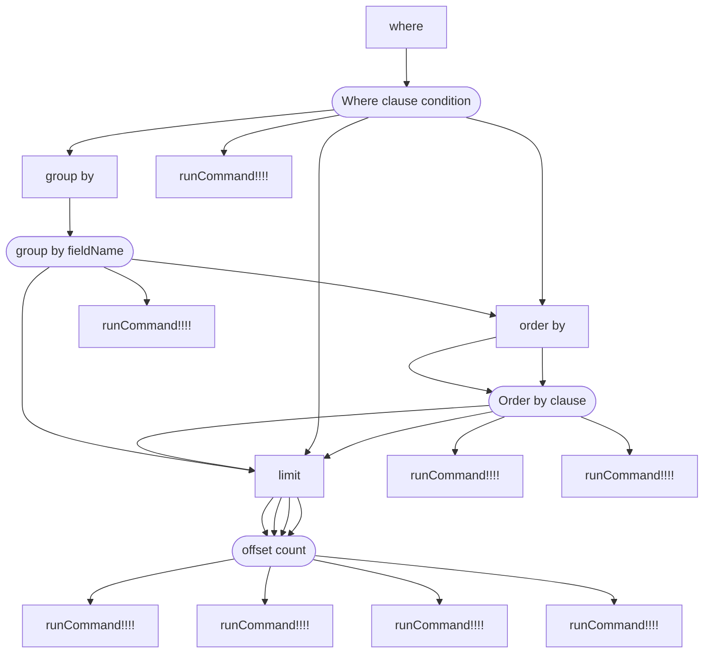

```mermaid
graph BR
1.504109395E9[where] --> 3.98887205E8[^_^]
3.98887205E8[^_^] --> 8.73415566E8[order by]
8.73415566E8[order by] --> 1.360767589E9[^_^]
1.360767589E9[^_^] --> 9.20011586E8[limit]
9.20011586E8[limit] --> 1.06083084E9[^_^]
1.06083084E9([offset count]) --> 0.4963339053446324[runCommand!!!!]
1.360767589E9([Order by clause]) --> 0.25697130402209956[runCommand!!!!]
3.98887205E8[^_^] --> 9.20011586E8[limit]
9.20011586E8[limit] --> 1.06083084E9[^_^]
1.06083084E9([offset count]) --> 0.28165226879176386[runCommand!!!!]
3.98887205E8[^_^] --> 1.468177767E9[group by]
1.468177767E9[group by] --> 1.531333864E9[^_^]
1.531333864E9[^_^] --> 8.73415566E8[order by]
8.73415566E8[order by] --> 1.360767589E9[^_^]
1.360767589E9[^_^] --> 9.20011586E8[limit]
9.20011586E8[limit] --> 1.06083084E9[^_^]
1.06083084E9([offset count]) --> 0.9835579628411513[runCommand!!!!]
1.360767589E9([Order by clause]) --> 0.8130567962037439[runCommand!!!!]
1.531333864E9[^_^] --> 9.20011586E8[limit]
9.20011586E8[limit] --> 1.06083084E9[^_^]
1.06083084E9([offset count]) --> 0.528578419992373[runCommand!!!!]
1.531333864E9([group by fieldName]) --> 0.8635107697696894[runCommand!!!!]
3.98887205E8([Where clause condition]) --> 0.5916920916856211[runCommand!!!!]

```