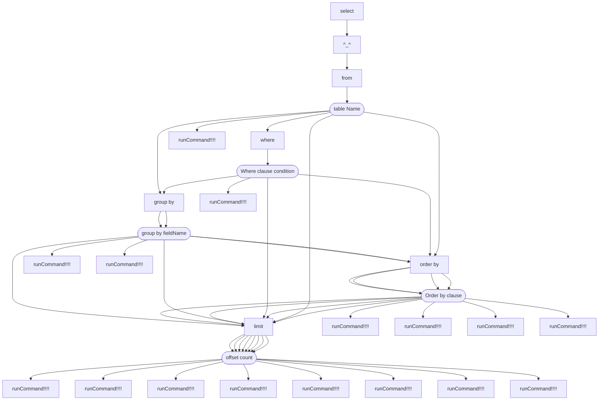

```mermaid
graph BR
1.57627094E8[select] --> 1.349414238E9[^_^]
1.349414238E9[^_^] --> 7.18231523E8[from]
7.18231523E8[from] --> 7.62218386E8[^_^]
7.62218386E8[^_^] --> 2.114889273E9[order by]
2.114889273E9[order by] --> 3.98887205E8[^_^]
3.98887205E8[^_^] --> 1.468177767E9[limit]
1.468177767E9[limit] --> 8.1840387E8[^_^]
8.1840387E8([offset count]) --> 0.8122668360468757[runCommand!!!!]
3.98887205E8([Order by clause]) --> 0.5346660459163152[runCommand!!!!]
7.62218386E8[^_^] --> 1.468177767E9[limit]
1.468177767E9[limit] --> 8.1840387E8[^_^]
8.1840387E8([offset count]) --> 0.9108576463170122[runCommand!!!!]
7.62218386E8[^_^] --> 6.72320506E8[where]
6.72320506E8[where] --> 1.873653341E9[^_^]
1.873653341E9[^_^] --> 2.114889273E9[order by]
2.114889273E9[order by] --> 3.98887205E8[^_^]
3.98887205E8[^_^] --> 1.468177767E9[limit]
1.468177767E9[limit] --> 8.1840387E8[^_^]
8.1840387E8([offset count]) --> 0.38988994659085785[runCommand!!!!]
3.98887205E8([Order by clause]) --> 0.736114109623022[runCommand!!!!]
1.873653341E9[^_^] --> 1.468177767E9[limit]
1.468177767E9[limit] --> 8.1840387E8[^_^]
8.1840387E8([offset count]) --> 0.5021201777032007[runCommand!!!!]
1.873653341E9[^_^] --> 2.047526627E9[group by]
2.047526627E9[group by] --> 1.504109395E9[^_^]
1.504109395E9[^_^] --> 2.114889273E9[order by]
2.114889273E9[order by] --> 3.98887205E8[^_^]
3.98887205E8[^_^] --> 1.468177767E9[limit]
1.468177767E9[limit] --> 8.1840387E8[^_^]
8.1840387E8([offset count]) --> 0.37482912086594644[runCommand!!!!]
3.98887205E8([Order by clause]) --> 0.5728742123216595[runCommand!!!!]
1.504109395E9[^_^] --> 1.468177767E9[limit]
1.468177767E9[limit] --> 8.1840387E8[^_^]
8.1840387E8([offset count]) --> 0.26800897027519544[runCommand!!!!]
1.504109395E9([group by fieldName]) --> 0.21435475053713293[runCommand!!!!]
1.873653341E9([Where clause condition]) --> 0.6310047723880974[runCommand!!!!]
7.62218386E8[^_^] --> 2.047526627E9[group by]
2.047526627E9[group by] --> 1.504109395E9[^_^]
1.504109395E9[^_^] --> 2.114889273E9[order by]
2.114889273E9[order by] --> 3.98887205E8[^_^]
3.98887205E8[^_^] --> 1.468177767E9[limit]
1.468177767E9[limit] --> 8.1840387E8[^_^]
8.1840387E8([offset count]) --> 0.9181123220174341[runCommand!!!!]
3.98887205E8([Order by clause]) --> 0.3670709602142167[runCommand!!!!]
1.504109395E9[^_^] --> 1.468177767E9[limit]
1.468177767E9[limit] --> 8.1840387E8[^_^]
8.1840387E8([offset count]) --> 0.6005543705647777[runCommand!!!!]
1.504109395E9([group by fieldName]) --> 0.620583729955577[runCommand!!!!]
7.62218386E8([table Name]) --> 0.9358284791917733[runCommand!!!!]
```